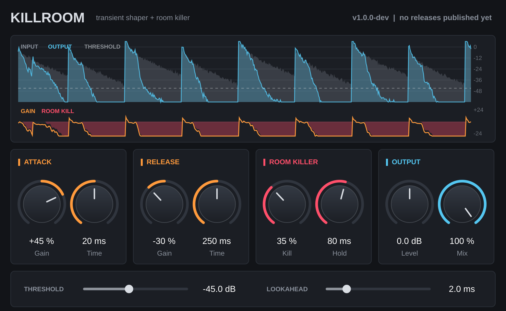

# Killroom

A transient shaper in the spirit of Logic's Enveloper, with a **room killer** for drums.
It's a VST3 audio effect for Ableton Live on macOS (Apple Silicon and Intel) and Windows,
and it can update itself from GitHub releases.



## Controls

| Section | Control | What it does |
| --- | --- | --- |
| Attack | Gain | Boosts (+) or softens (−) the start of every hit. |
| | Time | How long the attack phase lasts. Longer times shape more of the hit. |
| Release | Gain | Brings up (+) or pulls down (−) the body and tail after each hit. At +100 % the tail decays at the Release Time. |
| | Time | The decay rate the release section compares against. |
| Room killer | Kill | Speeds up the decay of each hit's tail once Hold has passed. Low settings tighten the room, 100 % gates it out. It works relative to each hit, so quiet ghost notes in a loud hit's tail survive. |
| | Hold | How long each hit rings untouched before the room killer acts. Raise it for toms and kicks with long bodies. |
| Output | Level | Output gain. |
| | Mix | Dry/wet blend (parallel shaping). |
| | Threshold | What counts as a hit. Quieter material is left alone by the shaper and treated as room (bleed) by the room killer. |
| | Lookahead | Lets the detector see hits early so fast attacks and the room killer's opening aren't late. Adds latency, which Live compensates for automatically. |

The display shows input (grey) and output (blue) levels, the threshold, the total gain being applied (orange), and the room killer's reduction (red).

## Install

Download the installer for your computer:

- **macOS** (Apple Silicon and Intel): [Killroom-macOS.pkg](https://github.com/dylancleverdon/drum-replacer/releases/latest/download/Killroom-macOS.pkg)
- **Windows** (64-bit): [Killroom-Windows-Setup.exe](https://github.com/dylancleverdon/drum-replacer/releases/latest/download/Killroom-Windows-Setup.exe)

These links always get the newest version. All releases are on the [releases page](https://github.com/dylancleverdon/drum-replacer/releases).

The installers aren't signed with an Apple or Microsoft developer certificate, so the first time you open one:

- **macOS** says it can't verify the installer. Click **Done**, open **System Settings → Privacy & Security**, scroll down to the message about Killroom-macOS.pkg and click **Open Anyway**. The plugin installs to `~/Library/Audio/Plug-Ins/VST3`.
- **Windows** SmartScreen may say "Windows protected your PC". Click **More info → Run anyway**. The plugin installs to `C:\Program Files\Common Files\VST3`.

Then restart Live. Killroom shows up under **Plug-Ins → VST3 → dylancleverdon**. If it doesn't, make sure
*Preferences → Plug-Ins → Use VST3 Plug-In System Folders* is on.

### Or install from the command line

This avoids the warnings above. On **macOS**, run this in Terminal:

```sh
curl -fsSL https://raw.githubusercontent.com/dylancleverdon/drum-replacer/HEAD/scripts/install-mac.sh | bash
```

On **Windows**, run this in PowerShell. It asks for admin rights:

```powershell
irm https://raw.githubusercontent.com/dylancleverdon/drum-replacer/HEAD/scripts/install-windows.ps1 | iex
```

## Updating

You don't need to reinstall anything.

- **From the plugin:** the top right of the window shows the version you're running and checks GitHub for a newer one. When there is one, click **Update to vX.Y.Z**, then restart Live. On Windows, an installer window opens and asks for admin rights.
- **Or** run the installer again: download it from the link above, or rerun the command-line install.

The copy of Killroom that Live already has loaded keeps running until you restart. Your Live sets keep their
Killroom settings across updates.

## How changes become updates

1. Make a change (or ask Claude to make one) and get it onto the repo's default branch.
2. GitHub Actions ([.github/workflows/build.yml](.github/workflows/build.yml)) builds macOS and Windows versions, runs the tests,
   validates the plugin with [pluginval](https://github.com/Tracktion/pluginval) and publishes a release
   named `vX.Y.Z` with the patch number counting up automatically. This takes about 10 minutes.
3. Killroom's update check sees the new release, and you click **Update**.

Pushes to any other branch or pull request build and test the plugin and upload the result as an Actions
artifact, but don't publish a release. To start a new minor or major version, edit [VERSION](VERSION).

## Building from source

You need CMake 3.22+ and a C++17 compiler (Xcode on macOS, Visual Studio 2022 on Windows). JUCE is downloaded automatically.

```sh
cmake -S . -B build -DCMAKE_BUILD_TYPE=Release
cmake --build build --config Release
ctest --test-dir build -C Release --output-on-failure
```

The plugin ends up in `build/Killroom_artefacts/Release/VST3/Killroom.vst3`. See [CLAUDE.md](CLAUDE.md)
for how the code is organised.

Killroom is built with [JUCE](https://juce.com), which is dual-licensed (AGPLv3, or a commercial licence).
